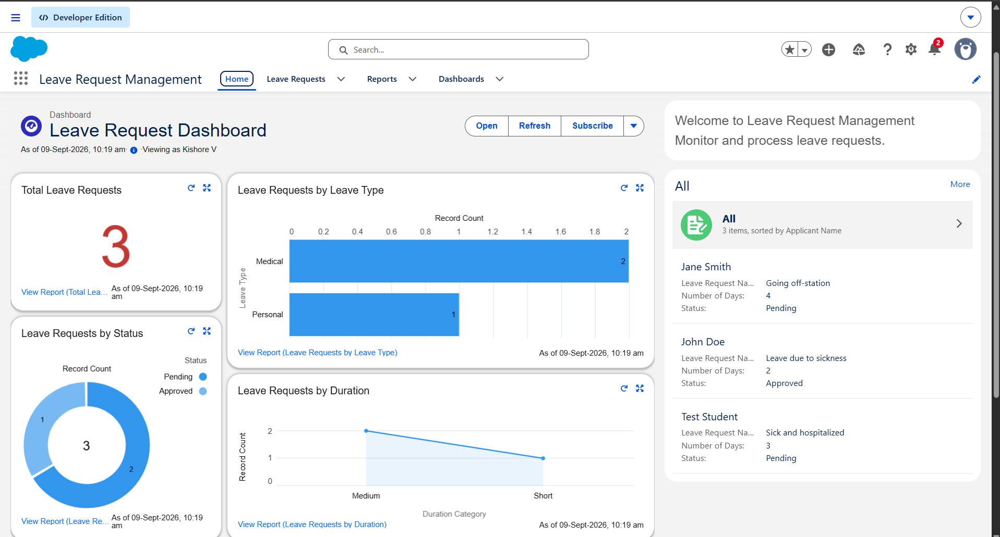

# Leave Request Management System

A Salesforce-based Leave Request Management System for managing faculty and student leave requests.

The project demonstrates Salesforce declarative automation, Apex development, REST API integration, reporting, dashboards, and Lightning application design.

## Overview

The system allows users to create and manage leave requests while Salesforce automatically handles status initialization and leave-duration categorization.



The project was developed as a practical Salesforce development project to demonstrate both **low-code Salesforce capabilities** and **programmatic development using Apex**.

## Features

- Create and manage leave requests
- Automatically set new requests to `Pending`
- Prevent approval of leave requests exceeding 5 days
- Automatically classify leave duration using Apex
- REST API support for creating leave requests
- Apex unit testing
- Reports for monitoring leave requests
- Dashboard for visualizing leave request data
- Custom Lightning App for centralized access to the system

## Technology Stack

| Technology | Purpose |
|---|---|
| Salesforce Platform | Application platform |
| Lightning App Builder | Application and UI configuration |
| Flow Builder | Declarative automation |
| Validation Rules | Data validation |
| Apex | Custom business logic |
| Apex Triggers | Event-driven processing |
| Apex Test Classes | Unit testing |
| Salesforce REST API | External record creation |
| Postman | API testing |
| Reports & Dashboards | Data analysis and visualization |
| Salesforce CLI | Metadata management and deployment |
| Git & GitHub | Version control |

## System Architecture

```text
                         Salesforce Platform
                                │
               ┌────────────────┼────────────────┐
               │                │                │
               ▼                ▼                ▼
        Lightning App        REST API        Reports &
               │                │             Dashboard
               ▼                ▼
        Leave Request ────────────────────────┐
               │                               │
               ▼                               │
        Record-Triggered Flow                 │
        Status = Pending                      │
               │                               │
               ▼                               │
        Validation Rule                       │
        >5 days cannot be Approved            │
               │                               │
               ▼                               │
        Apex Trigger                          │
               │                               │
               ▼                               │
        LeaveRequestHandler                   │
        Duration Classification               │
               │                               │
               ▼                               │
        Leave Request Record ◄────────────────┘
````

## Data Model

The system currently uses one custom Salesforce object:

### Leave Request

**Object:** `Leave_Request__c`

| Field             | Purpose                                 |
| ----------------- | --------------------------------------- |
| Name              | Leave request name                      |
| Applicant Name    | Person requesting leave                 |
| Leave Type        | Type of leave                           |
| Number of Days    | Requested leave duration                |
| Status            | Current request status                  |
| Duration Category | Apex-calculated duration classification |

## Automation

### Record-Triggered Flow

When a new Leave Request record is created, a record-triggered Flow automatically sets:

```text
Status = Pending
```

This keeps the initial state consistent without requiring users or integrations to provide the status manually.

### Validation Rule

The system prevents a leave request from being approved when the requested duration exceeds five days.

```text
Number of Days > 5
AND
Status = Approved
```

This protects the business rule regardless of whether the change originates from the UI or another supported Salesforce operation.

## Apex

### LeaveRequestHandler

The `LeaveRequestHandler` Apex class contains the logic used to classify leave requests according to their duration.

### LeaveRequestTrigger

The `LeaveRequestTrigger` invokes the handler when Leave Request records are processed.

The trigger and handler are separated so that the business logic remains outside the trigger itself.

### Testing

`LeaveRequestHandlerTest` contains Apex unit tests for the duration classification logic.

The test class verifies that the handler produces the expected category for different leave durations.

## REST API Integration

Leave Requests can be created through the Salesforce REST API.

Postman was used to authenticate with Salesforce and test API requests.

Example request payload:

```json
{
  "Name": "Sick and hospitalized",
  "Applicant_Name__c": "Test Student",
  "Leave_Type__c": "Medical",
  "Number_of_Days__c": 3
}
```

Fields such as `Status` and `Duration_Category__c` are intentionally omitted because they are populated by Salesforce automation.

A successful request returns the newly created Salesforce record ID and a successful creation response.

## Reports & Dashboard

The project contains reports for monitoring and analyzing leave requests.

Current reports include:

* Leave Request Overview
* Pending Leave Requests
* Leave Requests by Status
* Leave Requests by Leave Type
* Leave Requests by Duration
* New Leave Requests Report

### Leave Request Dashboard

The dashboard provides a centralized view of:

* Total Leave Requests
* Requests by Status
* Requests by Leave Type
* Requests by Duration
* Pending Leave Requests

## Lightning App

The project includes a custom Lightning App:

**Leave Request Management**

The application provides navigation to:

* Home
* Leave Requests
* Reports
* Dashboards

The custom Home page embeds the Leave Request Dashboard along with a Leave Request list view, providing a single workspace for monitoring the system.

## Project Structure

```text
force-app/
└── main/
    └── default/
        ├── applications/
        │   └── Leave_Request_Management.app-meta.xml
        │
        ├── classes/
        │   ├── LeaveRequestHandler.cls
        │   ├── LeaveRequestHandler.cls-meta.xml
        │   ├── LeaveRequestHandlerTest.cls
        │   └── LeaveRequestHandlerTest.cls-meta.xml
        │
        ├── dashboards/
        │   └── LeaveRequestDashboards.dashboardFolder-meta.xml
        │
        ├── flexipages/
        │   └── Home.flexipage-meta.xml
        │
        ├── objects/
        │   └── Leave_Request__c/
        │       ├── fields/
        │       ├── listViews/
        │       └── validationRules/
        │
        ├── reports/
        │   ├── LeaveRequestsReport.reportFolder-meta.xml
        │   └── LeaveRequestsReport/
        │
        └── triggers/
            ├── LeaveRequestTrigger.trigger
            └── LeaveRequestTrigger.trigger-meta.xml
```

## Deployment

The project is structured as a Salesforce DX project and can be managed using Salesforce CLI.

### Prerequisites

* Salesforce CLI
* A Salesforce org with appropriate development access
* Git

### Clone the Repository

```bash
git clone https://github.com/vk22006/leave-request-management-system.git
cd leave-request-management-system
```

### Authenticate a Salesforce Org

```bash
sf org login web --alias LeaveRequestOrg
```

### Set the Target Org

```bash
sf config set target-org=LeaveRequestOrg
```

### Deploy the Source

```bash
sf project deploy start --source-dir force-app
```

## Testing

Apex tests can be executed against the target Salesforce org using Salesforce CLI.

Example:

```bash
sf apex run test --target-org LeaveRequestOrg --test-level RunLocalTests
```

## Development Approach

The project follows a simple separation of responsibilities:

```text
Declarative Logic
    │
    ├── Flow
    └── Validation Rule

Programmatic Logic
    │
    ├── Apex Trigger
    ├── Apex Handler
    └── Apex Test Class

Integration
    │
    └── REST API + Postman

Presentation
    │
    ├── Lightning App
    ├── Reports
    └── Dashboard
```

The implementation intentionally uses declarative Salesforce features where they are sufficient and Apex where custom processing is required.

## Future Improvements

Potential extensions include:

* Approval workflow for leave requests
* Email or in-app notifications
* Role-based access control
* Additional analytics
* Bulk API processing for large volumes
* Enhanced exception handling for integrations
* Additional automated test coverage